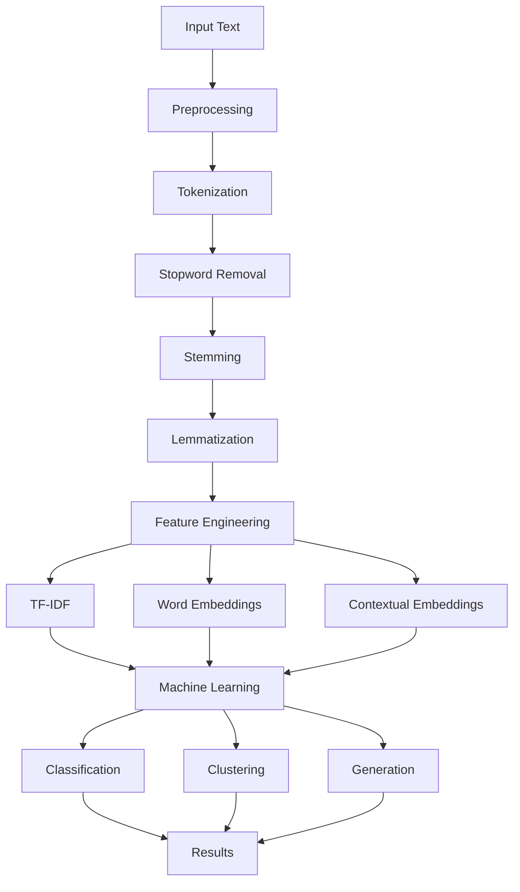
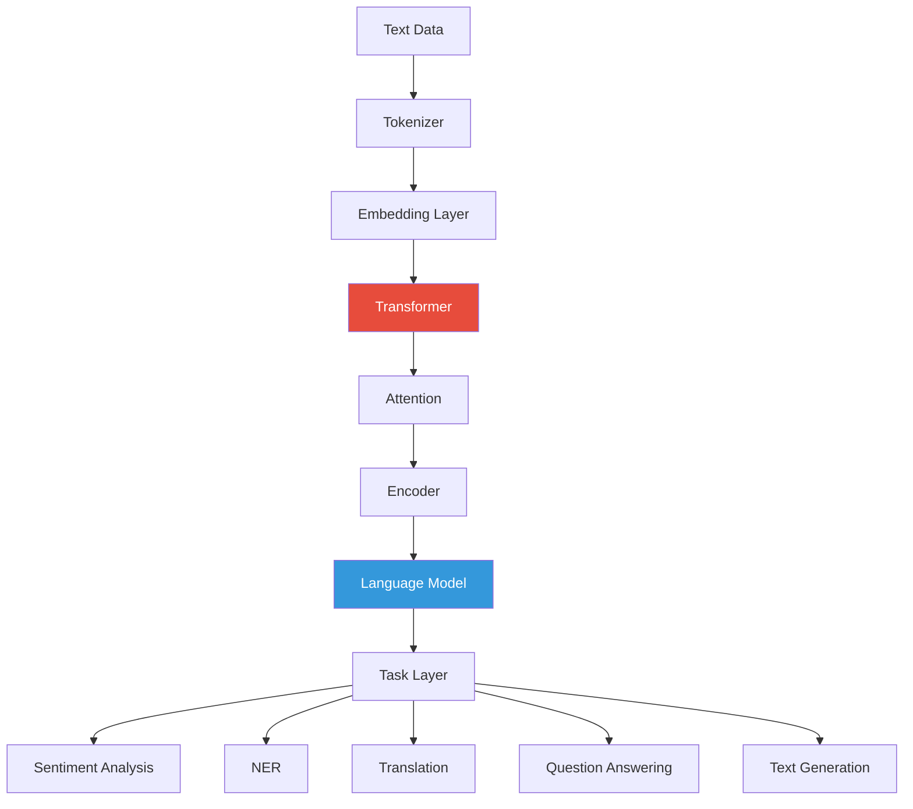
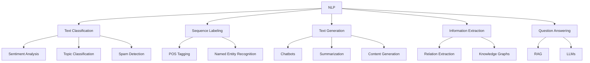
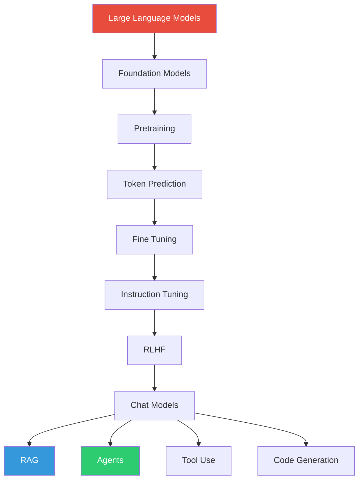

# NLP Workflow

## 1. NLP Processing Pipeline

```mermaid
flowchart LR

A[Raw Text]

--> B[Text Cleaning]

--> C[Tokenization]

--> D[Normalization]

--> E[Feature Extraction]

--> F[NLP Model]

--> G[Prediction]

--> H[Output]

style A fill:#3498db,color:#fff
style E fill:#f1c40f,color:#000
style F fill:#e74c3c,color:#fff
style H fill:#2ecc71,color:#fff
```

## 2. Complete NLP Workflow

```mermaid
flowchart TD

A[Input Text]

--> B[Preprocessing]

B --> C[Tokenization]
C --> D[Stopword Removal]
D --> E[Stemming]
E --> F[Lemmatization]

F --> G[Feature Engineering]

G --> H[TF-IDF]
G --> I[Word Embeddings]
G --> J[Contextual Embeddings]

H --> K[Machine Learning]
I --> K
J --> K

K --> L[Classification]
K --> M[Clustering]
K --> N[Generation]

L --> O[Results]
M --> O
N --> O
```
## 3. Modern NLP Architecture

```mermaid
flowchart TD

A[Text Data]

--> B[Tokenizer]

--> C[Embedding Layer]

--> D[Transformer]

D --> E[Attention]

E --> F[Encoder]

F --> G[Language Model]

G --> H[Task Layer]

H --> I[Sentiment Analysis]
H --> J[NER]
H --> K[Translation]
H --> L[Question Answering]
H --> M[Text Generation]

style D fill:#e74c3c,color:#fff
style G fill:#3498db,color:#fff
```

## 4. NLP Task Taxonomy

```mermaid
flowchart TD

A[NLP]

A --> B[Text Classification]
A --> C[Sequence Labeling]
A --> D[Text Generation]
A --> E[Information Extraction]
A --> F[Question Answering]

B --> B1[Sentiment Analysis]
B --> B2[Topic Classification]
B --> B3[Spam Detection]

C --> C1[POS Tagging]
C --> C2[Named Entity Recognition]

D --> D1[Chatbots]
D --> D2[Summarization]
D --> D3[Content Generation]

E --> E1[Relation Extraction]
E --> E2[Knowledge Graphs]

F --> F1[RAG]
F --> F2[LLMs]
```

## 5. LLM Ecosystem

```mermaid
flowchart TD

A[Large Language Models]

A --> B[Foundation Models]

B --> C[Pretraining]

C --> D[Token Prediction]

D --> E[Fine Tuning]

E --> F[Instruction Tuning]

F --> G[RLHF]

G --> H[Chat Models]

H --> I[RAG]
H --> J[Agents]
H --> K[Tool Use]
H --> L[Code Generation]

style A fill:#e74c3c,color:#fff
style I fill:#3498db,color:#fff
style J fill:#2ecc71,color:#fff
```
