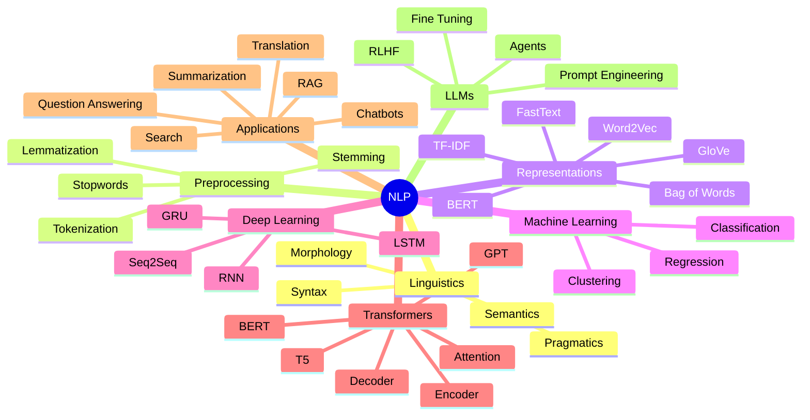
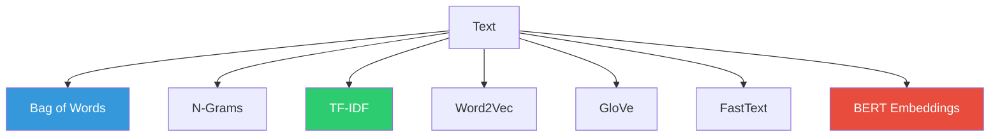

# **`Awesome`** [NLP](https://wikipedia.org/wiki/Natural_language_processing) (_Natural Language Processing_) 

    
    &nbsp;
    
    &nbsp;
    
    

## 📖 Contents
- [My Other Awesome Lists](#my-other-awesome-lists)
- [Contributing](#contributing)
- [Contributors](#contributors)

## Word Segmentation (_Tokenization_)

Tokenization is a text-processing technique that divides text into individual words or word fragments. This technique results in two key components: **`a word index`** and **`tokenized text`**. The word index is a list that maps unique words to specific numerical identifiers, and the tokenized text replaces each word with its corresponding numerical token. These numerical tokens are then used in various deep learning methods.

## Embedding Vector
* 🧠 What Does embedding_dim Mean?: The embedding_dim is the number of values in each word’s vector representation. So if:
    * `embedding_dim = 64` → each word is a 64‑dimensional vector
    * `embedding_dim = 128` → each word is a 128‑dimensional vector
    * `embedding_dim = 256` → each word is a 256‑dimensional vector

The embedding matrix size is: **`vocab_size × embedding_dim`**

##

### My Other Awesome Lists
You can access the my other awesome lists [here](https://cyberthreatdefence.com/my_awesome_lists)

### Contributing
[Contributions of any kind welcome, just follow the guidelines](contributing.md)!

### Contributors
[Thanks goes to these contributors](https://github.com/cybersecurity-dev/awesome-natural-language-processing/graphs/contributors)!

### License

[🔼 Back to top](#awesome-nlp-natural-language-processing-)
